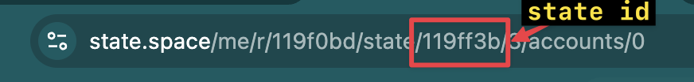

# Unsafe VaultManager
This is an example of a buggy VaultManager for storing ETH. The `withdrawPacked` function is vulnerable to unauthorized withdrawal and access control due to an unsafe narrow type handling of the uint8, vault ID, and a bool flag values in assembly. This README will walk you through the steps of how to use the State Space tool to discover the behavior of the contract and uncover the bug. 

## Table of Contents
- [Vulnerability in withdrawPacked](#vulnerability-in-withdrawpackedbytes32-req)
- [Setup and Upload](#setup-and-upload)
- [Design Transaction Sequence](#design-transaction-sequence)
- [Review Results](#review-results)
- [State Analysis](#state-analysis)
- [Exporting a Test Case (for PoC, Test Suite, Debugging)](#export-test-case-for-a-pocdebugging-or-test-suite)
- [Experimental](#experimental)

## Vulnerability in `withdrawPacked(bytes32 req)`

- `req` is a 32-byte packed argument of `vaultId` (unit8) and `overrideFlag` (bool), where the last byte is the vault ID, and the second-last byte is a boolean override. 
- If `flagByte` is neither 0x00 nor 0x01, the contract performs no access control checks before withdrawing. This means an attacker can withdraw from any vault by crafting a value for `req`.
- An attacker can assume admin privilege and withdraw funds from another user stored within the VaultManager.

## Setup and Upload:

1. Create an account at https://state.space/sign-up
2. Clone the repo to a local folder
3. Install the State Space CLI using brew: `brew install state-space/state-space/cli`. Note: the Foundry project already has a state-space.toml file created from initializing the repo (`state-space init`).
4. From the main directory of the DirtyVault Foundry project, run the CLI command `state-space push` command to deploy the contract to your State Space account:   

``` bash
state-space push
```

You will be prompted to login using your State Space credentials.


## Design transaction sequence

After authenticating, navigate to your home dashboard at https://state.space/me and "Start a New Workbench". Rename it to `DirtyVaultProject`. 

From within Workbench, you should see the `DirtyVault` project appear in the **drop down** along with the source version you pushed via the CLI. Select the source version and it's folder tree will appear:


Expand the folder tree to expose all external functions and then drag an Empty Deployment to the canvas. Rename the deployment to whatever you like:


To explore the state space, we'll need to set a sequence of transactions to explore. A typical functional flow for the VaultManager will be to deposit eth and then withdraw their balance. 

For this example:
- Claire will deploy the contract and have the admin role (calls the `constructor`)
- Alice and Bob will call `deposit` and specify a vaultId (in this case, we set it to 1 and 10 respectively - they can be any ID within the specified max vault size of 12). 
- Bob will call `withdrawPacked`, and leave the packed byte data field blank to act symbolically. 

By default all parameters and primitives are set to act symbolically unless a concrete value is specified. State Space allows you to set concrete values where needed to help manage the world state and size of the state space to explore. Without proper constraints, you can easily run into state space explosion and generate tens of thousands of states.

 Your final sequence should look like this:


Click the green "Play" icon to start the analysis. 


## Review results:

State Space will formally derive (via symbolic execution) all feasible execution paths and the valid, verified inputs that trigger them in the lower pane, representing the exact behavior of code. Because we use a full semantics model of the EVM to symbolically execute the bytecode, we can detect deep edge cases, and even bugs in within the Solidity compiler.  All test cases are validated with multiple references for precision. 

11 paths (or possible states) will be discovered, with three succeeding. Scroll through the resulting paths (the test cases) to discover the actual behavior of the code. Each path is clickable for a deeper analysis. Below is a screenshot of a suspicious path:


Select the vulnerable path to analyze the state. Explore other paths and states as well. 

## State Analysis

Each transaction on the top row is interactive, and cycle through them to notice the difference in contract state and any state changes. 

The state resulting from calling  `withdrawPacked` show the specific `req` byte32 value that could be used to gain admin privilege and drain Alice's account into Bob's account. 

Since this vulnerability is related to dirty bits, you can also view the raw storage values change as you cycle through the transactions. 

Decoded storage:


Raw storage:


## Export test case for a PoC,debugging, or test suite

You can export the test case by either selecting the `Export Test` button or using the CLI and referencing the state id of the test case located in the URL. 

How to locate the stateid in the URL:



### Export via CLI command
```bash
state-space export test <STATEID> -out <FOLDER>
```

## Experimental

Click the AI Description button, and it will use a reasoning model to analyze the test case (the actual verified executed code behavior) for security and risk (unlike LLMs and AI security scanners that analyze the code statically). This feature does not yet take full account of the full context of the source code, but we have upcoming features that will drastically improve these capabilities to search and assess the state space.

